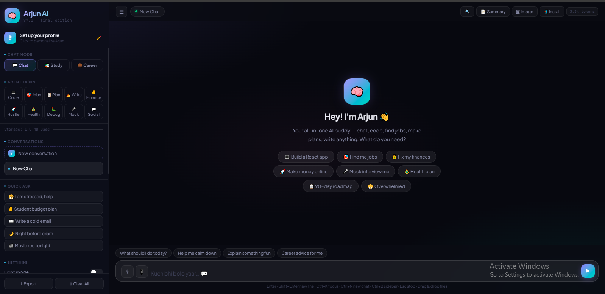

<!-- ================= HERO ================= -->
<h1 align="center">🤖 Arjun AI</h1>
<h3 align="center">Personal AI Agent for College Students</h3>

<p align="center">
  
</p>

<p align="center">
  
  
  
  
</p>

---

> ⚡ Built as a real-world AI product — not just a chatbot

---

## 📸 Preview  



---

## 🚀 What is Arjun AI?  

**Arjun AI** is a production-grade AI assistant designed for college students.  
It combines **multiple intelligent agents**, real-time streaming, and a polished UI—all running entirely in the browser.

- ❌ No backend  
- ❌ No frameworks  
- ✅ Just open `index.html` and run  

---

## ✨ Core Features  

- 🤖 **10 Specialized AI Agents**  
- ⚡ **Real-time Streaming (SSE)**  
- 🧠 **Conversation Memory**  
- 🎤 **Voice Input (Indian English)**  
- 📂 **File Upload + Image Analysis**  
- 💬 **Multiple Chat Sessions**  
- 🌙 **Dark/Light Mode**  

---

## 🧠 AI Agents  

| Agent | Purpose |
|------|--------|
| 💻 Code | Production-ready code |
| 🎯 Jobs | Companies + salary + emails |
| 📋 Plan | Daily/weekly roadmap |
| ✍️ Write | Full content generation |
| 💰 Finance | Budget + SIP |
| 🚀 Hustle | Side income |
| 🧘 Health | Fitness + diet |
| 🐛 Debug | Fix bugs |
| 🎤 Mock | Interview practice |
| 💬 Social | Communication scripts |

---

## 🏗️ System Architecture  


User Input → UI (Vanilla JS)
→ State (localStorage)
→ API (Fetch + SSE)
→ AI Model (Groq / Claude)
→ Stream Handler
→ UI Render (real-time)


---

## 🛠 Tech Stack  

<p align="center">
  
</p>

- Vanilla JavaScript  
- Pure CSS  
- Groq / Claude API  
- Fetch API + SSE  
- localStorage  
- Web Speech API  

---

## ⚙️ Setup  

```bash
git clone https://github.com/YOUR_USERNAME/arjun-ai.git
cd arjun-ai
open index.html

👉 Enter your API key inside the app

🧪 Testing
node tests/arjun.test.js

✔ 122 tests covering:

Security (XSS)
API handling
Storage
Chat logic
🔥 Why This Project Stands Out
Built without frameworks
Implements real-time streaming (SSE)
Handles production-level problems
Includes 10 specialized AI agents
Focused on real student use-case
👨‍💻 Author

Vedant Kadiya
💻 Python Developer | 🤖 AI/ML Enthusiast
## 📫 Connect  

[](https://www.linkedin.com/in/vedant-kadiya-55196127a)

[](mailto:vedantkadiya@gmail.com)
